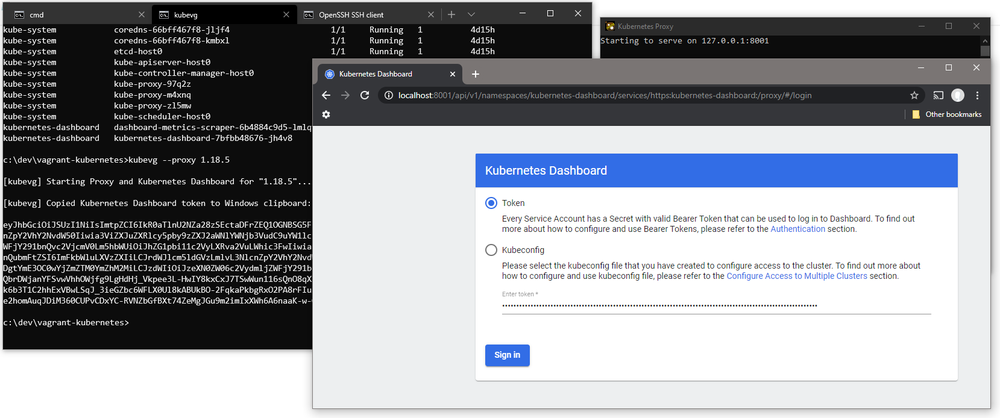

# vagrant-kubernetes

Vagrantfile to setup a Kubernetes cluster consisting of 1 master and 2 nodes as VM's running on your local machine

---

## Updated version

Forked from original: <https://github.com/grahamdaley/vagrant-kubernetes>

- Supports Kubernetes: **1.18+** (includes option to change version)
- Addons: network weave|flannel|calico|canal, dashboard, metrics, nginx, metallb
- Supports multiple simultanious k8s versions using 'kubevg.bat'

## Documentation

If you're new to Kubernetes and/or Vagrant or need detailed instructions reading the included [Original readme](README.md#Original-readme) by 'grahamdaley' is a good place to start.

These topics are specific for this updated version:

- [Usage](README.md#Usage)
- [Multiple versions](README.md#Multiple-versions)
- [Dashboard](README.md#Dashboard)
- [CHANGES.md](CHANGES.md)
- Comments inside [Vagrantfile](Vagrantfile)

## Usage

You need Virtualbox and Vagrant (and optionally kubectl).

On Windows you can use [Chocolatey](https://chocolatey.org): `choco install virtualbox vagrant kubernetes-cli`

The Vagrantfile includes options for Addons and test Pods, these can be left as-is however.

Run `vagrant up` to automatically provision a complete and ready to use k8s cluster. On Windows you can also use [kubevg.bat](README.md#Multiple-versions).

All created host VM's will have names prefixed by **kubevg-** for example 'kubevg-host0'.

In case of network issues in Kubernetes:

- have a look at 'Network IP ranges (RFC 1918)' in the Vagrantfile
- try changing to the default prefixes for pods and pool
- if you have network overlap try using an other block
- If you're still having issues test if changing network addons helps (e.g. Flannel instead of Calico)

## Multiple versions

Multiple k8s versions can co-exist by using 'kubevg.bat' for Windows. All versions will use the same Vagrantfile.

This can be useful if you want to test deployments in different k8s versions for example.

See 'Kubevg' and 'Example' below for details .

_You could even try running concurrent clusters. This would require `$IP_RANDOM = 1` to be set in the Vagrantfile so it uses different ip ranges for the VM's (untested). The ip prefix will be written to `.ip_prefix` in each k8s version subdir._

### Kubevg

`C:\dev\vagrant-kubernetes>kubevg.bat -h`

``` batch

-------------------------------------------------------------------------------
[kubevg]                 (Kube)rnetes (V)a(g)rant wrapper
-------------------------------------------------------------------------------

  This wrapper will change dir to "k8s-version" subdir first before running
  running Vagrant or kubectl, thus allowing multiple Kubernetes versions
  to co-exist (using the same Vagrantfile).

SYNTAX:  ".\kubevg.bat [--help|--version|--list|--clip|--proxy] <k8s-version>
         ".\kubevg.bat [--create|--recreate|--reinstall] <k8s-version>"

OPTIONS: --help show these help instructions
         --list show available Kubernetes version subdirs
         --version show available Kubernetes Ubuntu package versions
         --create <k8s-version> create new version subdir, runs "vagrant up"
         --recreate <k8s-version> re-create using "vagrant destroy" then "up"
         --reinstall <k8s-version> remove version subdir first, then recreate
         --clip <k8s-version> copy K8s Dashboard token to clipboard
         --proxy <k8s-version> start proxy and K8s Dashboard

WRAPPER SYNTAX: ".\kubevg.bat <k8s-version> [vagrant|kubectl <command>]"
     > VAGRANT: ".\kubevg.bat <k8s-version> vagrant <help|commmand>"
     > KUBECTL: ".\kubevg.bat <k8s-version> kubectl <help|commmand>"

EXAMPLES: ".\kubevg.bat --create 1.13.0"
          ".\kubevg.bat 1.13.0 vagrant ssh kubevg-host0"
          ".\kubevg.bat 1.13.0 kubectl get nodes"

```

### Example

First run `kubevg --create 1.18.5` then after it's done you'll see the new version listed:

``` batch
C:\dev\vagrant-kubernetes>kubevg --list

[kubevg] Found 3 Kubernetes versions/subdirs:

         1.18.5 1.18.3 1.16.3

  Cluster/API info: "kubevg <k8s-version> kubectl cluster-info"
  Token: "kubevg --clip <k8s-version>"
  Dashboard: Open "<k8s-version>\Dashboard.html" in web browser

```

Running Vagrant:

``` batch
C:\dev\vagrant-kubernetes>kubevg.bat 1.18.5 vagrant status
Current machine states:

kubevg-host0              running (virtualbox)
kubevg-host1              running (virtualbox)
kubevg-host2              running (virtualbox)

This environment represents multiple VMs. The VMs are all listed
above with their current state. For more information about a specific
VM, run `vagrant status NAME`.
```

If you want to ssh to a host VM use: `kubevg.bat 1.18.5 vagrant ssh kubevg-host2`

To run kubectl.exe:

``` batch
C:\dev\vagrant-kubernetes>kubevg 1.18.5 kubectl get pods --all-namespaces

[kubevg] Currently using: 1.18.5

NAMESPACE              NAME                                         READY   STATUS    RESTARTS   AGE
default                busybox                                      1/1     Running   8          1h
default                hello-server-57684579f-bvz87                 1/1     Running   0          1h
kube-system            calico-kube-controllers-68dddfc554-w8zhd     1/1     Running   0          1h
kube-system            calico-node-5k8pp                            1/1     Running   0          1h
kube-system            calico-node-84nxs                            1/1     Running   0          1h
kube-system            calico-node-h8txs                            1/1     Running   0          1h
kube-system            calicoctl                                    1/1     Running   0          1h
kube-system            coredns-66bff467f8-7lgdc                     1/1     Running   0          1h
kube-system            coredns-66bff467f8-nbrjx                     1/1     Running   0          1h
kube-system            etcd-host0                                   1/1     Running   0          1h
kube-system            kube-apiserver-host0                         1/1     Running   0          1h
kube-system            kube-controller-manager-host0                1/1     Running   0          1h
kube-system            kube-proxy-45jw4                             1/1     Running   0          1h
kube-system            kube-proxy-hrmzf                             1/1     Running   0          1h
kube-system            kube-proxy-tf2tx                             1/1     Running   0          1h
kube-system            kube-scheduler-host0                         1/1     Running   0          1h
kubernetes-dashboard   dashboard-metrics-scraper-6b4884c9d5-hjx6h   1/1     Running   0          1h
kubernetes-dashboard   kubernetes-dashboard-7bfbb48676-85ftd        1/1     Running   0          1h
```

## Dashboard

Enable the Kubernetes Dashboard in the Vagrantfile by setting `$K8S_DASHBOARD = 1`.

Two files will be created:

- "dashboard-token.txt" containing a bearer token to login
- "Dashboard.html" which auto redirects to the Dashboard URL

To open the Dashboard quick and easy:

 _Replace 1.2.3 by k8s version_

On Windows run `kubevg.bat --proxy 1.2.3` to start kubectl, copy token to clipboard automatically and open the Dashboard in your default browser.

This can also be done by running `kubevg.bat 1.2.3 kubectl proxy` and copying the token using `kubevg.bat --clip 1.2.3`.

Lastly you can also start `kubectl proxy` yourself and copy the token from 'dashboard-token.txt'.

Now open 'Dashboard.html' and paste the token.



## Changes

See [CHANGES.md](CHANGES.md)

---

### Original readme

README from <https://github.com/grahamdaley/vagrant-kubernetes>

#### Kubernetes

> _Kubernetes (commonly referred to as "k8s") is an open source container cluster manager originally designed by Google and donated to the Cloud Native Computing Foundation. It aims to provide a platform for automating deployment, scaling, and operations of application containers across clusters of hosts. It usually works with the Docker container tool and coordinates between a wide cluster of hosts running Docker_
 – [from Wikipedia](https://en.wikipedia.org/wiki/Kubernetes).

#### Minikube

Kubernetes includes a command line tool, Minikube, which is a tool that makes it easy to run Kubernetes locally. Minikube runs a single-node Kubernetes 'cluster' inside a VM on your local computer. It is focused on users looking to try out Kubernetes or develop with it day-to-day. While Minikube is easy to use and will help you get going quickly, it is restricted to just one node, and so won't allow you to really test your application in a multi-node environment.

#### Vagrant

This Vagrant script carries out all of the major steps required to setup a Kubernetes cluster on your local machine, running Ubuntu Linux, using the free VirtualBox application. This cluster may be setup on any Mac or Windows PC supported by VirtualBox and Vagrant.

This cluster enables application containers to be tested in a multi-node environment, to see how well they respond to the challenges of scaling. It can also help identify any issues related to concurrency, even while in the development environment, so they can be resolved as early as possible in the development process.

The cluster consists of Kubernetes 3 hosts:

- one Kubernetes Master
- two Kubernetes Nodes

## Download

- __[VirtualBox](https://www.virtualbox.org/)__
  - Install this to run virtual machines on your local Mac or Windows PC.

- __[Vagrant](https://www.vagrantup.com/)__
  - Install this to allow quick and easy setup of the virtual machines we will be using in this article.

- __[kubectl](https://kubernetes.io/docs/user-guide/prereqs/)__
  - Install this on your local Mac/PC, to allow you to control your cluster and access the Kubernetes dashboard through a web browser.

## Configuring and Running the Virtual Machines

1. Download the [Vagrantfile](https://raw.githubusercontent.com/mkorthof/vagrant-kubernetes/master/Vagrantfile) and save it in a new, empty folder on your Mac or Windows PC.

2. Start up the VMs in one go

   `$ vagrant up`

    You will then see a number of messages, starting with:

    ``` sh
      Bringing machine 'master' up with 'virtualbox' provider...
      Bringing machine 'node1' up with 'virtualbox' provider...
      Bringing machine 'node2' up with 'virtualbox' provider...
    ```

    as Vagrant downloads the 'box' image (the image of the basic VM we will be using) and sets up each of the 3 VM instances.

    Once the box image has been downloaded, numerous additional packages will be downloaded and installed automatically, including those required for Docker and Kubernetes. This process will take approximately 15 minutes to complete.

3. Get the configuration for our new Kubernetes cluster so we can access it directly from our local machine

    - Mac: `$ export KUBECONFIG="$KUBECONFIG:$(pwd)/admin.conf"`
    - Windows: `SET "KUBECONFIG=%KUBECONFIG%;%CD%\admin.conf"`

4. Optionally, proxy the admin console to your local Mac/Windows PC

    - `$ kubectl proxy`

You can also use `--kubeconfig` instead of the "KUBECONFIG" env var:

``` batch
C:\vagrant-kubernetes\kubectl --kubeconfig admin.conf proxy
```

Leaving the above command running, access the [Kubernetes Admin Console](http://localhost:8001/ui) in your web browser.

You should now have a fully working Kubernetes cluster running on your local machine, on to which you can deploy containers using either the admin console or the kubectl command line tool.

---
